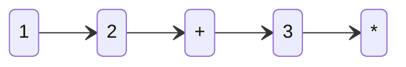
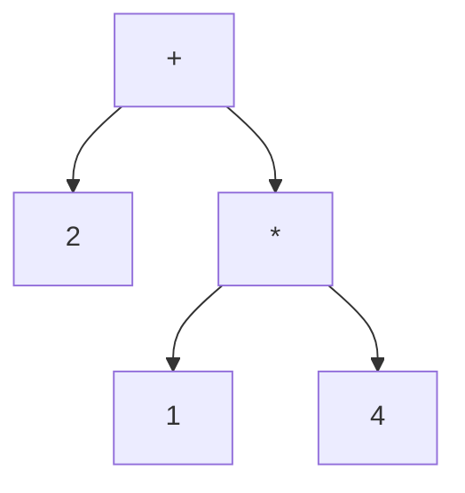
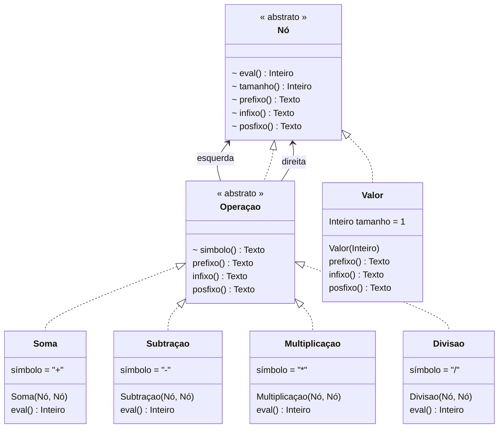

# Árvore Binária de Expressão







```scala
tipo abstrato Nó
  eval(): Inteiro
  tamanho(): Inteiro
  prefixo(): Texto
  infixo(): Texto
  posfixo(): Texto
fim

tipo abstrato Operação: Nó
  esquerda(): Nó
  direita() : Nó
  símbolo() : Texto
  tamanho() = 1 + esquerda.tamanho + direita.tamanho
  prefixo() = "{símbolo} {esquerda.prefixo} {direita.prefixo}"
  infixo()  = "({esquerda.infixo} {símbolo} {direita.infixo})"
  posfixo() = "{esquerda.posfixo} {direita.posfixo} {símbolo}"
fim

tipo Valor: Nó
  eval: Inteiro
  tamanho = 1
  prefixo, infixo, posfixo = eval.texto
fim

tipo Soma: Operação
  esquerda, direita: Nó
  símbolo = "+"
  eval() = esquerda.eval + direita.eval
fim

tipo Subtração: Operação
  esquerda, direita: Nó
  símbolo = "-"
  eval() = esquerda.eval - direita.eval
fim

tipo Multiplicação: Operação
  esquerda, direita: Nó
  símbolo = "*"
  eval() = esquerda.eval * direita.eval
fim

tipo Divisão: Operação
  esquerda, direita: Nó
  símbolo = "/"
  eval() = esquerda.eval div direita.eval
fim

arvore(pilha: Lista[Texto]): Nó =
  se ["+", "-", "*", "/"].contem(pilha.cabeça) então
    operação = escolha pilha.cabeça
      caso "+" => Soma
      caso "-" => Subtração
      caso "*" => Multiplicação
      caso "/" => Divisão
    fim
    direita  = arvore(pilha.cauda)
    esquerda = arvore(pilha.cauda.descarte(direita.tamanho))
    operação(esquerda, direita)
  senão
    Valor(pilha.cabeça.inteiro)
  fim

pilha = leia_texto.divida(" ").inverta
a = arvore(pilha)
escreva a
escreva "Infixo : {a.infixo}"
escreva "Prefixo: {a.prefixo}"
escreva "Posfixo: {a.posfixo}"
escreva "Eval   : {a.eval}"
```
