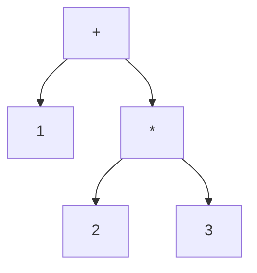
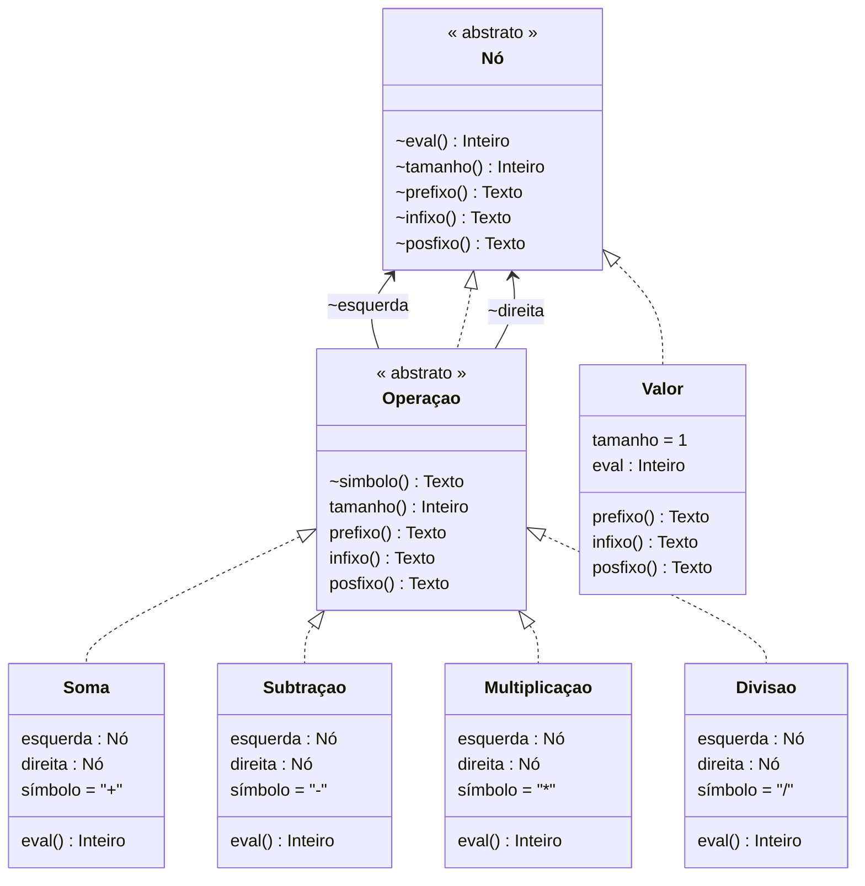

# Árvore Binária de Expressão

<a href="arvorebinaria.poti">Código Fonte</a>

Construção de uma árvore binária para representar expressões aritmética envolvendo números inteiros e os operadores binários +, -, *, /.

O programa lê uma expressão aritmética escrita em notação polonesa e gera uma árvore binária para representá-la. Depois cálcula o valor da expressão e reescreve a expressão na notação prefixa e infixa.

## Entrada

```cmd
1 2 3 * +
```

## Árvore



## Saída

```cmd
Soma(Valor(1),Multiplicação(Valor(2),Valor(3)))
Infixo : (1 + (2 * 3))
Prefixo: + 1 * 2 3
Posfixo: 1 2 3 * +
Eval   : 7
```

## Implemenação

Usamos tipos (classes) para representar os nós da árvores binária.




```ruby
tipo abstrato Nó
  eval(): Inteiro
  tamanho(): Inteiro
  prefixo(): Texto
  infixo(): Texto
  posfixo(): Texto
fim

tipo abstrato Operação: Nó
  esquerda(): Nó
  direita() : Nó
  símbolo() : Texto
  tamanho() = 1 + esquerda.tamanho + direita.tamanho
  prefixo() = "{símbolo} {esquerda.prefixo} {direita.prefixo}"
  infixo()  = "({esquerda.infixo} {símbolo} {direita.infixo})"
  posfixo() = "{esquerda.posfixo} {direita.posfixo} {símbolo}"
fim

tipo Valor: Nó
  eval: Inteiro
  tamanho = 1
  prefixo, infixo, posfixo = eval.texto
fim

tipo Soma: Operação
  esquerda, direita: Nó
  símbolo = "+"
  eval() = esquerda.eval + direita.eval
fim

tipo Subtração: Operação
  esquerda, direita: Nó
  símbolo = "-"
  eval() = esquerda.eval - direita.eval
fim

tipo Multiplicação: Operação
  esquerda, direita: Nó
  símbolo = "*"
  eval() = esquerda.eval * direita.eval
fim

tipo Divisão: Operação
  esquerda, direita: Nó
  símbolo = "/"
  eval() = esquerda.eval div direita.eval
fim
```

A função recursiva `árvore` recebe uma pilha de tokens (números e símbolos) de uma expressão aritmética em notação reversa e gera uma árvore binária cujos nós são os elementos da expressão.

```ruby
arvore(pilha: Lista[Texto]): Nó =
  se ["+", "-", "*", "/"].contem(pilha.cabeça) então
    operação = escolha pilha.cabeça
      caso "+" => Soma
      caso "-" => Subtração
      caso "*" => Multiplicação
      caso "/" => Divisão
    fim
    direita  = arvore(pilha.cauda)
    esquerda = arvore(pilha.cauda.descarte(direita.tamanho))
    operação(esquerda, direita)
  senão
    Valor(pilha.cabeça.inteiro)
  fim

pilha = leia_texto.divida(" ").inverta
a = arvore(pilha)
escreva a
escreva "Infixo : {a.infixo}"
escreva "Prefixo: {a.prefixo}"
escreva "Posfixo: {a.posfixo}"
escreva "Eval   : {a.eval}"
```
